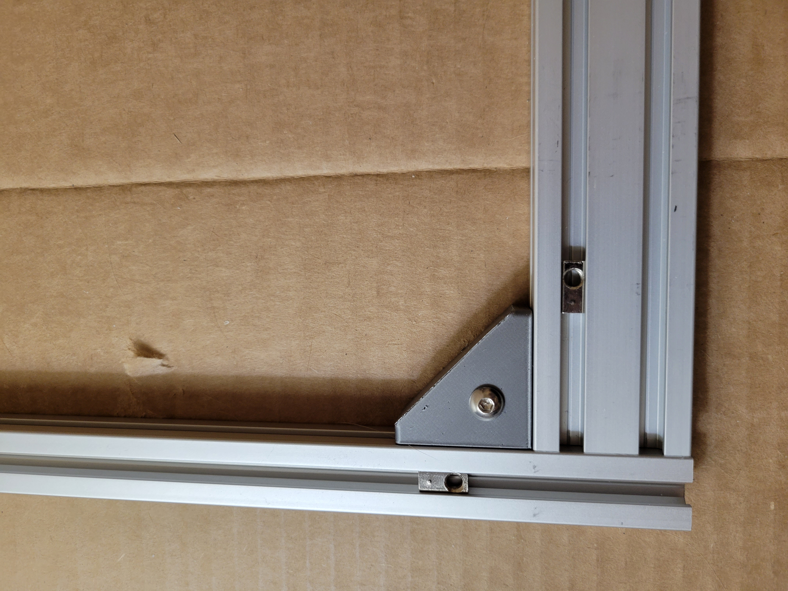

*This document is actively being refined and edited for mistaeks.*

## 1. Assembling the Sides

We will start with the left side, but have the parts ready for both.
### A. Parts

| ID    | Qty | Description               |
|-------|-----|---------------------------|
| L1    | 1   | 2020 Extrusion, 620mm     |
| L2    | 1   | 2040 Extrusion, 620mm     |
| L3    | 1   | 2040 Extrusion, 800mm     |
| L4    | 1   | 2040 Extrusion, 800mm     |
| R1    | 1   | 2020 Extrusion, 620mm     |
| R2    | 1   | 2040 Extrusion, 620mm     |
| R3    | 1   | 2040 Extrusion, 800mm     |
| R4    | 1   | 2040 Extrusion, 800mm     |
| PN532 | 16  | Screw, M5-0.8 x 12mm BHCS |
| PN577 | 16  | Washer, M5, Split Lock    |
| PN700 | 8   | Corner Bracket, Tapped    |

!!! note
    L5 and R5 will be added in later in this section.

!!! caution
    Always square each corner before tightening a bracket. See the previous section for instructions.

### B. General Steps

The steps for both sides are the same:

1. Square the first section and attach a bracket.
2. Use two (2) M5x12mm and two (2) split lock washers.
3. Add another section of frame with a bracket and pair of screws and lock washers.
4. Keep going around the corners adding brackets.
5. Continually check your work for a good, square fit as you go.
6. Attach the fourth bracket. If the frame is squared, it will readily slide in place.

### C. Left Side

| Step | Example |
|---|---|
| Attach L1 and L3 |  |
| Attach L1 and L4 |  |
| Attach L2 and L4 |  |
| Attach L2 and L3 |  |

### D. Right Side

Repeat the above steps with the pieces for the right side (R1-R4) and the remaining fasteners.
## 2. L5 and R5 Crossbars

### A. Parts

| ID    | Qty | Description               |
|-------|-----|---------------------------|
| L5    | 1   | 2020 Extrusion, 540mm     |
| R5    | 1   | 2040 Extrusion, 540mm     |
| PN532 | 8   | Screw, M5-0.8 x 12mm BHCS |
| PN577 | 8   | Washer, M5, Split Lock    |
| PN700 | 4   | Corner Bracket, Tapped    |

### B. General Steps

As above, the steps are the same for both sides.

1. Position the crossbars roughly centered on the side frame, or about 400mm from the edge
2. Loosely fasten two (2) brackets into place with M5x12 screws and lock washers.
3. Use a square before tightening the screws.
4. Once the top brackets are tightened, add in the bottom brackets.

!!! note
    You can set the second side of the frame on top of the first to simplify positioning for the second set of brackets.

### C. Left Side

| Step | Example |
|---|---|
| Measure 400mm from the edge. |  |
| Install two brackets. |  |
| Square the crosspiece. |  |
| Add bottom brackets | 

### D. Right Side

Repeat the steps above for the right side with R5 and the remaining fasteners.

## 3. Bracket Covers

### A. Parts

| ID    | Qty | Description                |
|-------|-----|----------------------------|
| PN090 | 16  | Misc, Corner Bracket Cover |
| PN530 | 16  | Screw, M5-0.8 x 8mm BHCS   |

### B. Steps

| Step | Example |
|------|---------|
| Slip a cover over the bracket. |  |
| Add an M5x8 screw and tighten. |  |
| Repeat for the remaining brackets. |  |

## 4. Frame Feet

### A. Parts

| ID    | Qty | Description                  |
|-------|-----|------------------------------|
| PN092 | 2   | Misc, Printer Base Foot, TPU |
| PN532 | 8   | Screw, M5-0.8 x 12mm BHCS    |

### B. Steps

| Step | Example |
|------|---------|
| Lay the left side of the frame flat. | |
| Line up the screw holes of one (1) of the Base Feet with the prepared roll-in tee nuts on the underside of L2 | |
| Fasten the foot with two (2) M5 x 12mm screws. | |
| Repeat for the other foot. |
| Install the other two feet on the right side in the same manner. | |

<!--  -->
