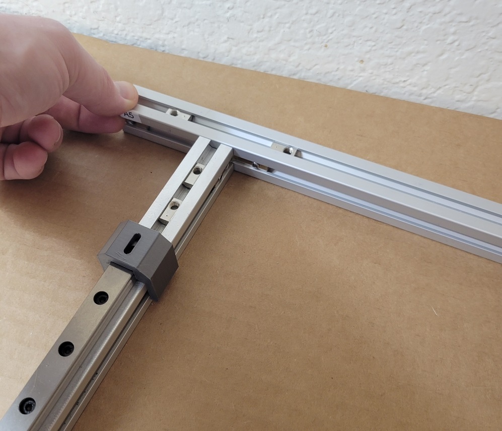
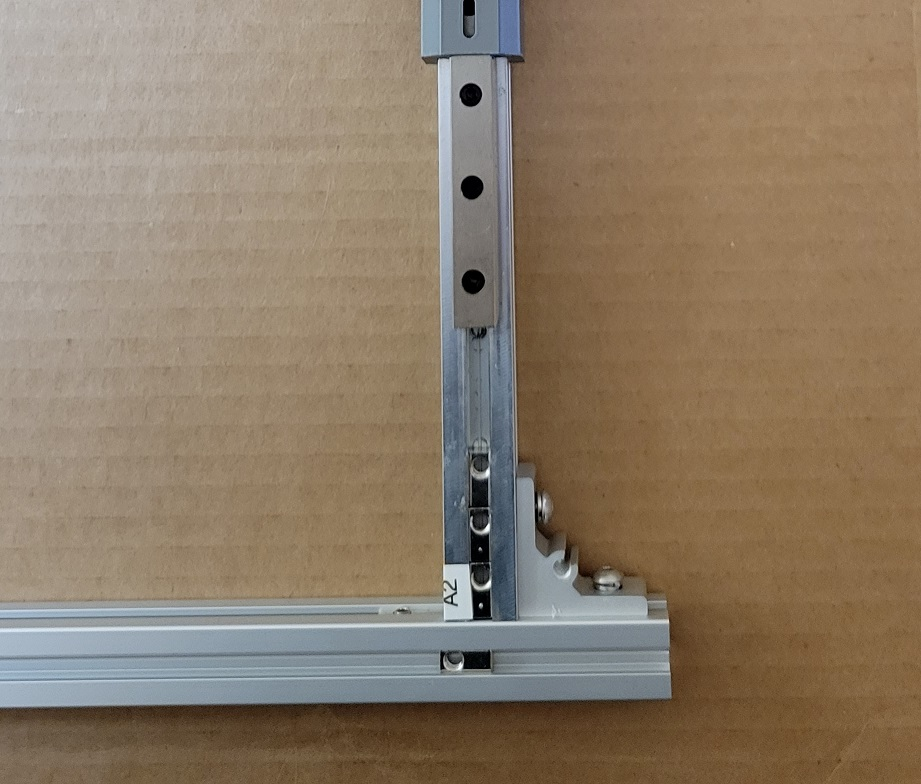

*This document is actively being refined and edited for mistaeks.*

## 1. Assemble XY Frame

### A. Parts

| ID    | Qty | Description                   | Notes |
|-------|-----|-------------------------------|-------|
| A1    | 1   | 2020 Extrusion, 440mm, Milled | |
| A2    | 1   | 2020 Extrusion, 440mm, Milled | |
| A4    | 1   | 2020 Extrusion, 620mm         | |
| A5    | 1   | 2020 Extrusion, 620mm         | |
| PN502 | 8   | Screw, M3-0.5 x 12mm SHCS     | |
| PN556 | 8   | Set Screw, M4-0.7 x 4mm       | Usually comes installed in PN701 |
| PN577 | 8   | Washer, M5, Split Lock        | |
| PN700 | 4   | Corner Bracket, Tapped        | |
| PN701 | 4   | Corner Bracket, Inside Hidden | |

### B. Install Hidden Corner Brackets

| Step | Example |
|------|---------|
| Install brackets as pictured. Note the orientation of the frame guides. |  |
| Slide A1 into A4 and A5 from the left. You will need to remove one tee nut each on A4 and A5. |  |
| Reinsert the tee nuts! |  |
| Square and tighten. |  |

### C. Install Tapped Corner Brackets

Each inside hidden bracket has a matching tapped corner bracket on the other side of the extrusion. Follow the usual procedure for attaching and squaring a corner bracket for all four.

## 2. Prepare Brackets

### Parts

| ID    | Qty | Description                   |
|-------|-----|-------------------------------|
| PN502 | 10  | Screw, M3-0.5 x 12mm SHCS     |
| PN577 | 10  | Washer, M5, Split Lock        |
| PN700 | 10  | Corner Bracket, Tapped        |

### A. Attach Brackets to XY Frame

### B. Attach Brackets to Z Extrusions

### C. Attach Brackets to Sides

## 3. Square and Tighten

### Parts

| ID    | Qty | Description                   |
|-------|-----|-------------------------------|
| PN502 | 10  | Screw, M3-0.5 x 12mm SHCS     |
| PN577 | 10  | Washer, M5, Split Lock        |

### A. Set XY Frame in Place

### B. Square and Measure

### C. Tighten

## 4. Add Bracket Covers

### Parts

| ID    | Qty | Description                         |
|-------|-----|-------------------------------------|
| PN090 | 14  | Corner Bracket Cover                |
| PN530 | 14  | Screw, M5-0.8 x 8mm BHCS            |