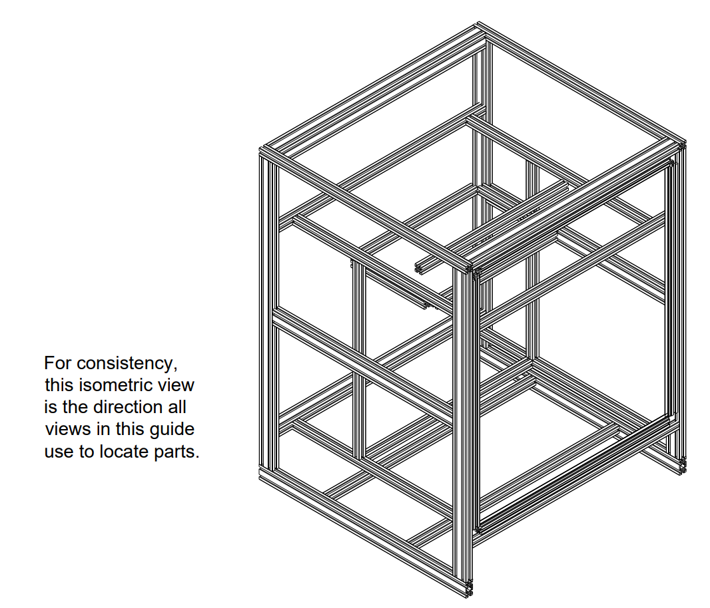
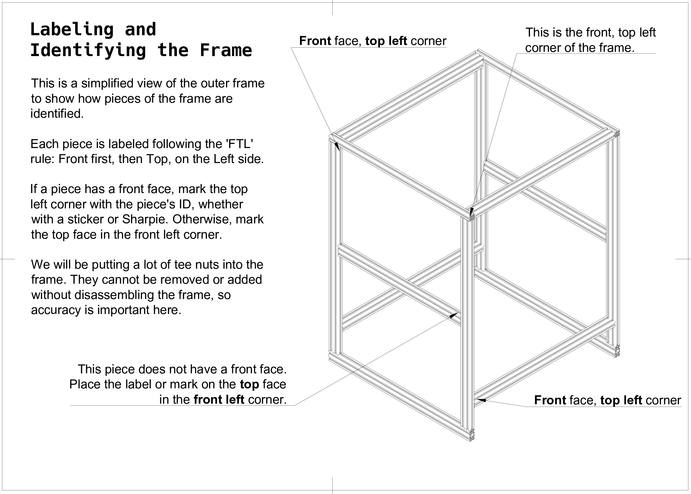
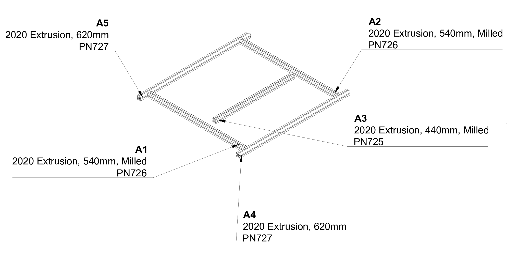
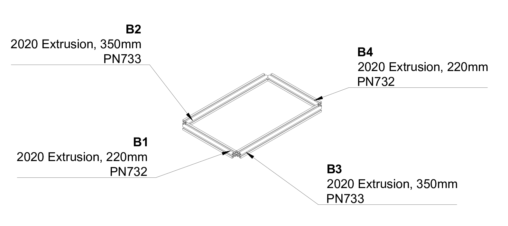
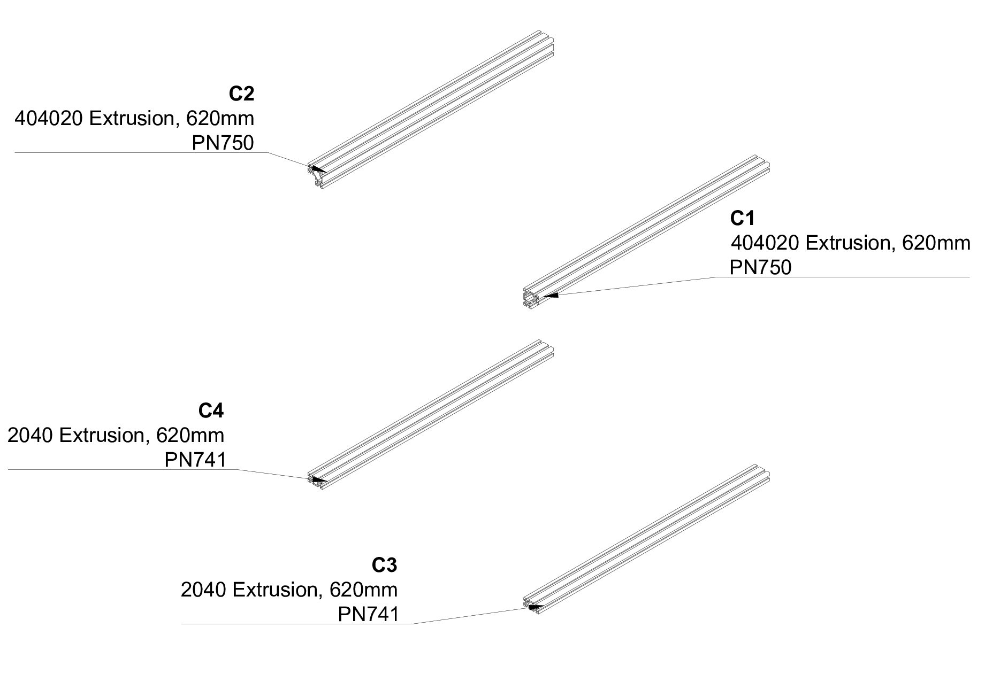
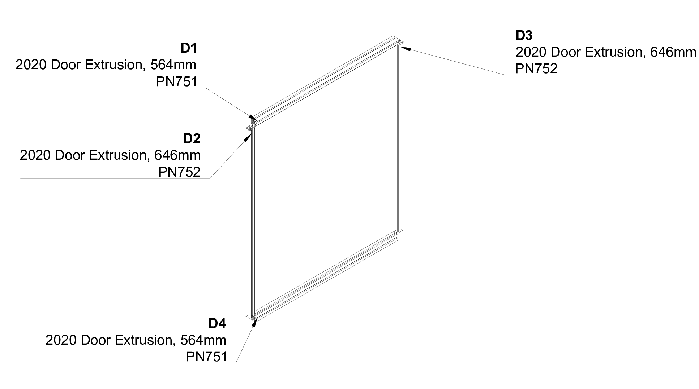
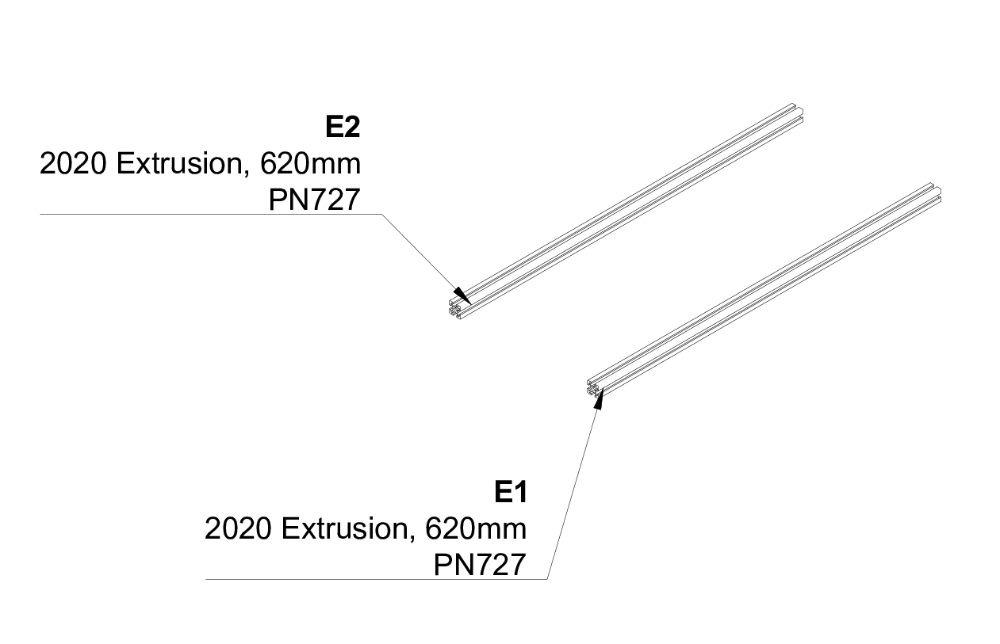
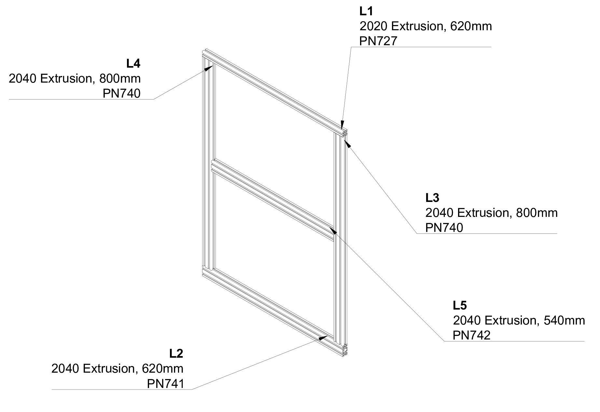
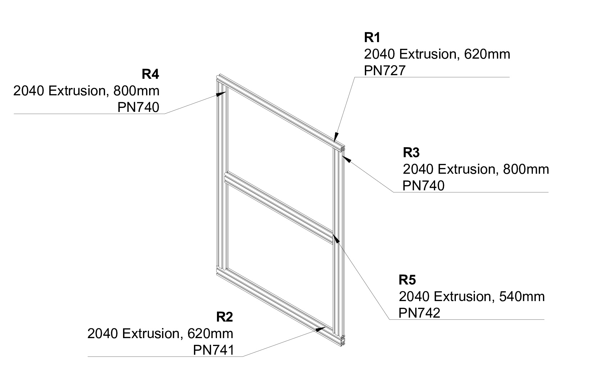
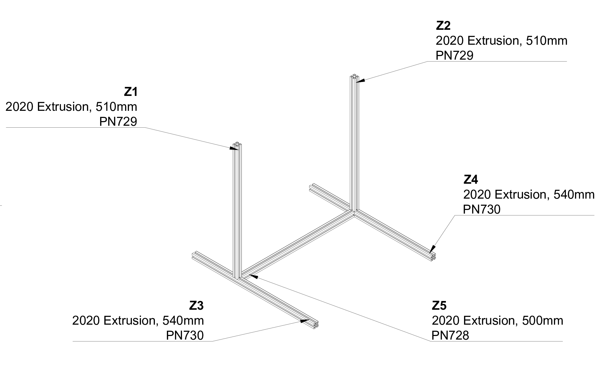

We've mentioned that each part of the frame has a unique ID to help identification and positioning. Let's label those now.

For your convenience, you can click any image to enlarge or use the [PDF version of this page](../../pdf/frame_labels.pdf).

!!! note "Musical Interlude"
    We're listening to The Heavy right now. Just sayin'.

## Instructions

## Frame Sections

### A. XY Axes

| ID | Part Number | Description |
|----|---|---|
| A1 | PN726 | 2020 Extrusion, 540mm, Milled |
| A2 | PN726 | 2020 Extrusion, 540mm, Milled |
| A3 | PN725 | 2020 Extrusion, 440mm, Milled |
| A4 | PN727 | 2020 Extrusion, 620mm |
| A5 | PN727 | 2020 Extrusion, 620mm |

### B. Bed Frame

| ID | Part Number | Description |
|----|---|---|
| B1 | PN732 | 2020 Extrusion, 220mm |
| B2 | PN732 | 2020 Extrusion, 220mm |
| B3 | PN733 | 2020 Extrusion, 350mm |
| B4 | PN733 | 2020 Extrusion, 350mm |

### C. Crossbars

| ID | Part Number | Description |
|----|---|---|
| C1 | PN750 | 404020 Extrusion, 620mm |
| C2 | PN750 | 404020 Extrusion, 620mm |
| C3 | PN741 | 2040 Extrusion, 620mm |
| C4 | PN741 | 2040 Extrusion, 620mm |

### D. Door

| ID | Part Number | Description |
|----|---|---|
| D1 | PN751 | 2020 Door Extrusion, 564mm |
| D2 | PN751 | 2020 Door Extrusion, 564mm |
| D3 | PN752 | 2020 Door Extrusion, 646mm |
| D4 | PN752 | 2020 Door Extrusion, 646mm |

### E. Electronics Mounting Bars

| ID | Part Number | Description |
|----|---|---|
| E1 | PN727 | 2020 Extrusion, 620mm |
| E2 | PN727 | 2020 Extrusion, 620mm |

### F. Left Side

| ID | Part Number | Description |
|----|---|---|
| L1 | PN727 | 2040 Extrusion, 620mm |
| L2 | PN741 | 2040 Extrusion, 620mm |
| L3 | PN740 | 2040 Extrusion, 800mm |
| L4 | PN740 | 2040 Extrusion, 800mm |
| L5 | PN742 | 2040 Extrusion, 540mm |

### G. Right Side

| ID | Part Number | Description |
|----|---|---|
| R1 | PN727 | 2040 Extrusion, 620mm |
| R2 | PN741 | 2040 Extrusion, 620mm |
| R3 | PN740 | 2040 Extrusion, 800mm |
| R4 | PN740 | 2040 Extrusion, 800mm |
| R5 | PN742 | 2040 Extrusion, 540mm |

### H. Z Axis

| ID | Part Number | Description |
|----|---|---|
| Z1 | PN729 | 2020 Extrusion, 510mm |
| Z2 | PN729 | 2020 Extrusion, 510mm |
| Z3 | PN730 | 2020 Extrusion, 540mm |
| Z4 | PN730 | 2020 Extrusion, 540mm |
| Z5 | PN728 | 2020 Extrusion, 500mm |

