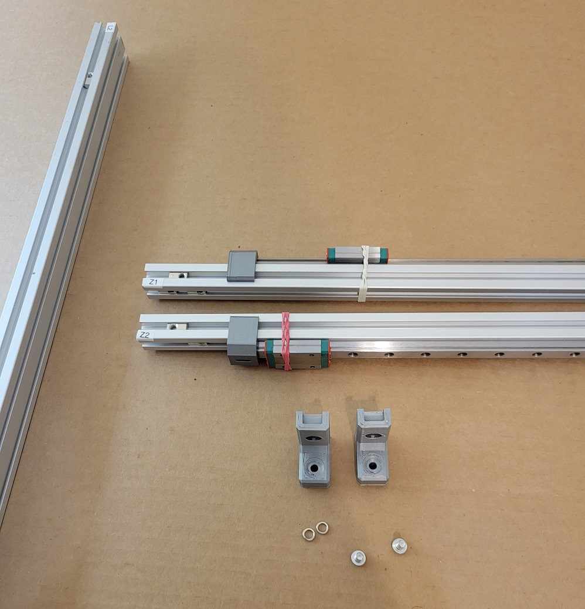
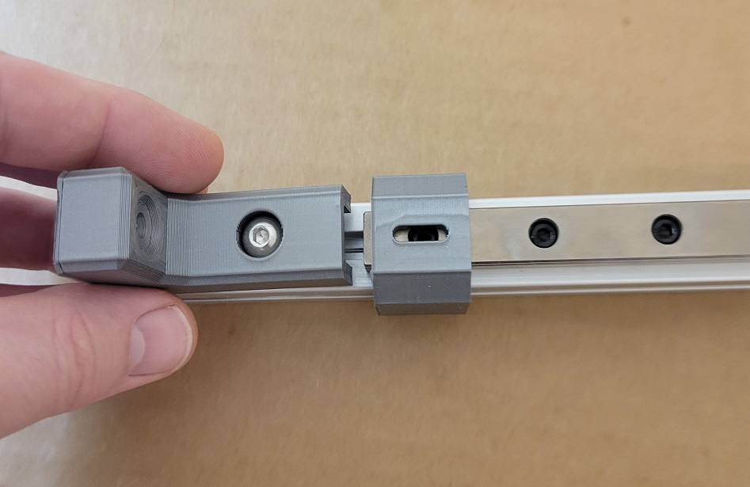
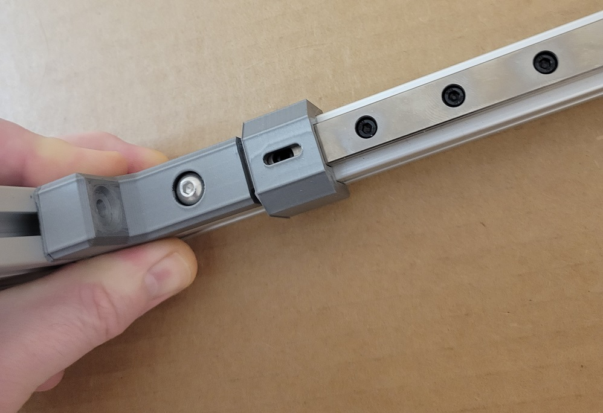
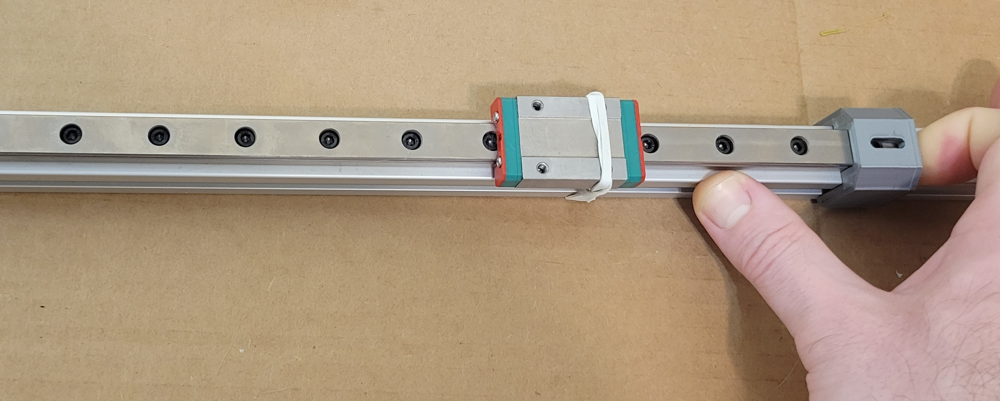
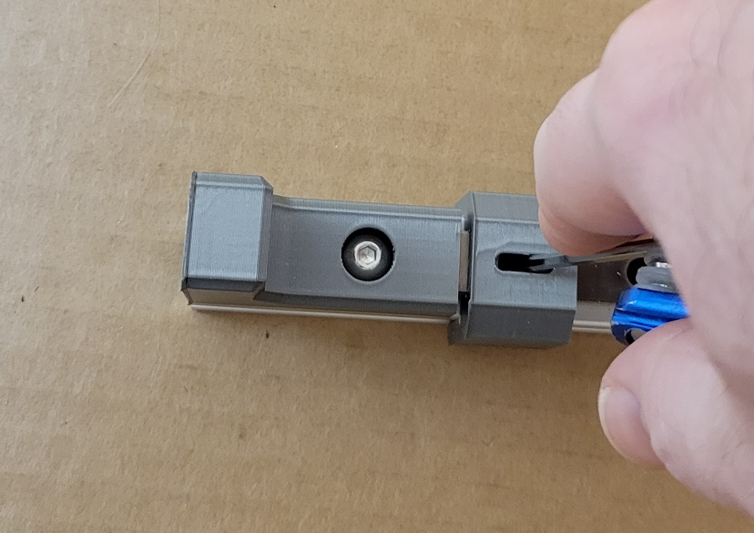
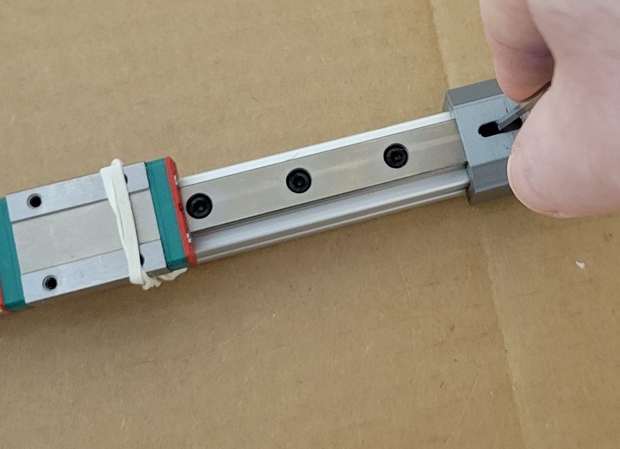

*This document is actively being refined and edited for mistaeks.*

At this point, all of our linear rails should be attached to an extrusion. The Z rails are aligned along the Z1 and Z2 extrusions with a bracket at the bottom. We need that bracket positioned when we assemble the frame, so we'll go ahead and lock down the rail, too.

## Parts

| ID    | Qty | Description |
|-------|----:|-------------|
| Z1    | 1   | PN729 with Linear Rail |
| Z2    | 1   | PN729 with Linear Rail |
| PN019 | 2   | Lower Rail Bracket     |
| PN532 | 2   | Screw, M5-0.8 x 12mm BHCS |
| PN577 | 2   | Washer, M5, Split Lock |

## Assembly
### A. Place Bracket

1. Insert a lock washer and screw into one of the brackets.
2. Set the bracket assembly on the *lower* end of the extrusion (following the FTL labeling rule)
3. Line the base of the bracket up roughly with the edge of the extrusion
4. Lightly secure the screw

### B. Align

1. Place a square or another piece of extrusion at the bottom of the bracket.
2. Firmly press on the assembly to ensure alignment.
3. Tighten the bracket in place.

### C. Position Linear Rail

1. Push the linear rail into the new bracket.
2. The bracket is a fairly tight fit; you may have to work it into place.

### D. Tighten the Rail

1. Check that both of the alignment brackets are flat to the rail with a good grip to center the rail.
2. Tighten the first and last screws on the extrusion, using the alignment bracket peephole if needed (see image).

### E. Repeat with Z2

Lastly, repeat the process for the Z2 rail and extrusion.
