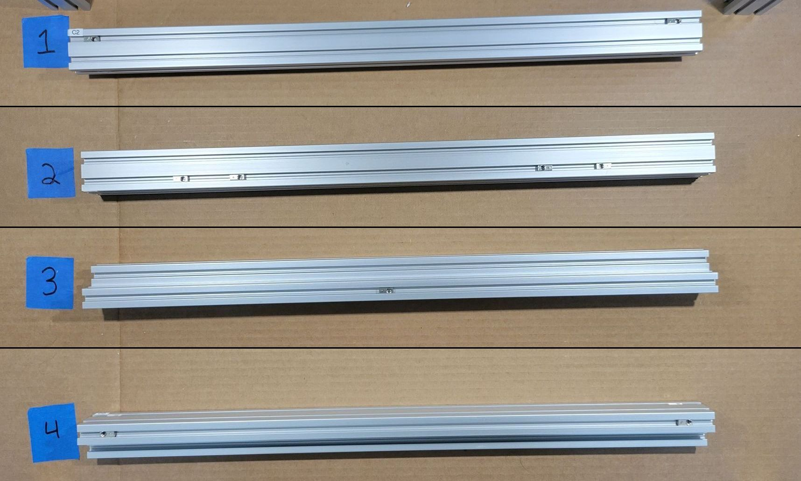
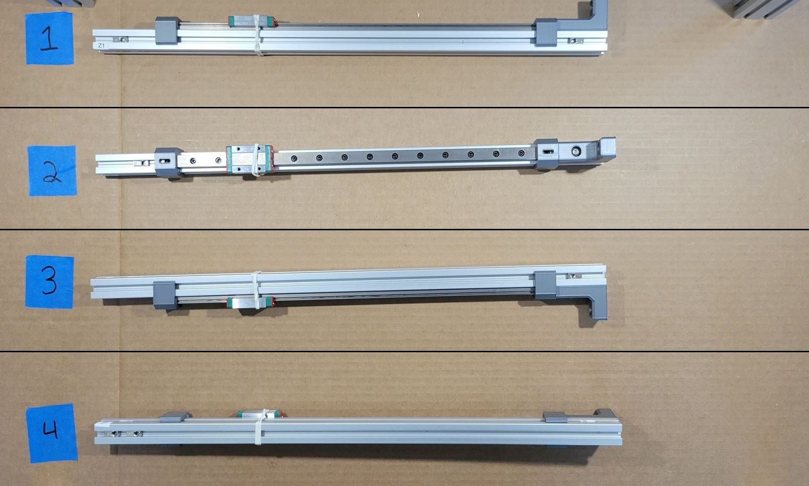

!!! note "Musical Suggestion"
    May we suggest [The Alan Parsons Project](https://youtube.com/playlist?list=OLAK5uy_lNCAUSEhegqjQAMMocw1QFu9G-bE4zeTM)?

There are a lot of tee nuts. Thankfully, this goes quickly with the extrusions labeled. The list below is fairly straightforward: the ID of the extrusion, the number of tee nuts needed, and a picture of roughly where each te`e nut goes. Click or tap the image to zoom in.
    
!!! attention
    - The tee nuts only need to be in the right channel and roughly in the right place. We will position them more precisely later.
    - Orientation only matters when a tee nut is near the edge of an extrusion. When a tee nut is very near the edge, put the roller bearing end in first. See [A3](../../img/tee_nuts/A3.jpg) for an example. Note that the hole is closer to the outer edge.

## Part List

Rather than a table, we'll use a short list:

- Every extrusion
- 275x PN575, Tee Nut, 6mm Slot, M5, Roll In (all of them)

## 1. XY Axis

| Extrusion | PN575 | Image |
|---|---|---|
| A1 | 11 |  |
| A2 | 11 |  |
| A3 | 6  |  |
| A4 | 6  |  |
| A5 | 11 |  |

## 2. Bed

| Extrusion | PN575 | Image |
|---|---|---|
| B1 | 10 |  |
| B2 | 10 |  |
| B3 | 8  |  |
| B4 | 8  |  |

## 3. Frame Crossbars

| Extrusion | PN575 | Image |
|---|---|---|
| C1 | 6  |  |
| C2 | 9  |  |
| C3 | 14 |  |
| C4 | 14 |  |

## 4. Door

There's only one slot to insert tee nuts on these extrusions, so they're all in one image.

| Extrusion | PN575 | Image |
|---|---|---|
| D1, D2, D3, D4 | 2, 4, 2, 2 |  |

## 5. Electrical Mounting Bars

| Extrusion | PN575 | Image |
|---|---|---|
| E1 | 4 |  |
| E2 | 4 |  |

## 6. Left External Frame

| Extrusion | PN575 | Image |
|---|---|---|
| L1 | 6  |  |
| L2 | 8  |  |
| L3 | 14 |  |
| L4 | 11 |  |
| L5 | 4  |  |

## 7. Right External Frame

| Extrusion | PN575 | Image |
|---|---|---|
| R1 | 6  |  |
| R2 | 8  |  |
| R3 | 11 |  |
| R4 | 11 |  |
| R5 | 4  |  |

## 8. Z Axis

!!! note
    Z1 and Z2 have a bracket already installed in the photo. For now, just install a tee nut there.

| Extrusion | PN575 | Image |
|---|---|---|
| Z1 | 7  |  |
| Z2 | 5  |  |
| Z3 | 15 |  |
| Z4 | 14 |  |
| Z4 | 10 |  |