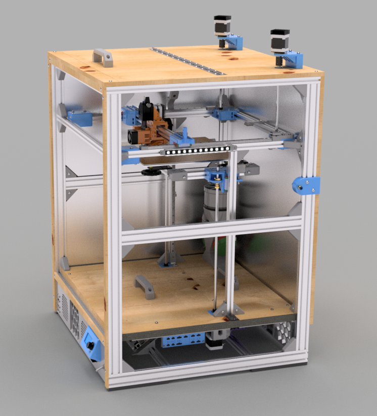

Welcome to the documentation project for the [Clock 3](https://github.com/jon-harper/clock-3/) 3D printer. Clock 3 is a project for an enclosed, CoreXY 3D printer in advanced stages of development.

## New Here?

Visit the [Overview](overview.md) to get a general idea about this project. Jump to the list of [Features](about/features.md) and [Frequently Asked Questions](about/features.md) to learn more.

There is also a [Gallery](about/gallery.md) of progress photos and renders.

## Need Help?

[Assembly](assembly/) and [Configuration](config/) documentation are under development.

## STLs, Source, and Licensing

The printer design, tools, drawings, and related files in the [Clock 3 GitHub](https://github.com/jon-harper/clock-3/) are open source and [released under the GPLv3](https://github.com/jon-harper/clock-3).

| March 2022 Front Render | Side with Panel Removed |
|:---:|:---:|
| |  |
