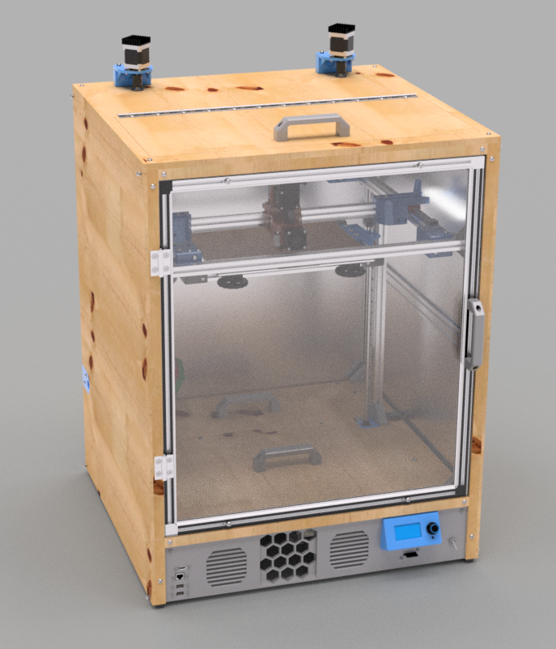

Welcome to the documentation project for the [Clock 3](https://github.com/jon-harper/clock-3/) 3D printer.

Clock 3 is a project for an enclosed, CoreXY 3D printer in advanced stages of development. You can visit the [Overview](overview.md) or skip to the list of [Features](about/features.md) and [Frequently Asked Questions](about/features.md) if you're interested in learning more. Help with [Assembly](assembly/) and [Configuration](config/) is available.

The printer design, tools, drawings, and related files in the [Clock 3 GitHub](https://github.com/jon-harper/clock-3/) are open source and [released under the GPLv3](https://github.com/jon-harper/clock-3). The documentation is [more freely licensed under the MIT License](https://github.com/jon-harper/clock3-docs/blob/main/LICENSE).

| March 2022 Front Render | Side with Panel Removed |
|:---:|:---:|
| |  |
